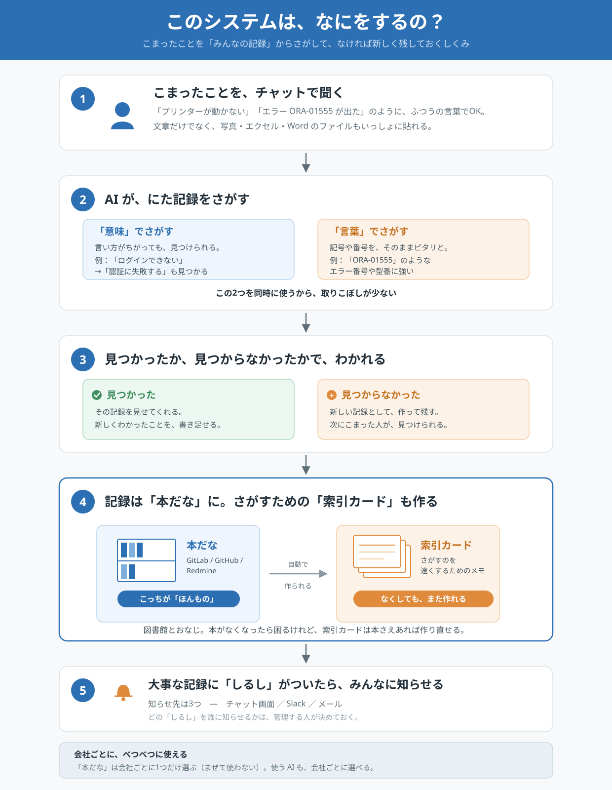

# 知識ベース検索・登録システム 要件整理

- 対象: 不具合報告・問い合わせを検索/登録できる知識ベースシステム
- 参照元: [issue-similarity-search-design_1.md](./issue-similarity-search-design_1.md)(GitLab限定の元設計を汎用化)
- ビジュアル版: https://claude.ai/code/artifact/c305e7b1-2c0f-406c-b7a5-7616808d9ff4 / ローカル版 [knowledge-base-system-requirements.html](./knowledge-base-system-requirements.html)
- やさしい全体像(非エンジニア向け): [system-overview.svg](./system-overview.svg)

## 全体像

## 概要

不具合報告や問い合わせを知識ベースから検索し、ヒットすれば表示・追記、未ヒットなら新規登録できるシステム。GitLabイシュー限定だった元の設計を土台に、対象knowledge base・LLM・テナントを汎用化する。

## 基本アーキテクチャ: 知識の実体はKB側にある

**外部KB(GitLab / GitHub / Redmine)が知識の正(source of truth)であり、pgvector は検索用インデックス**という位置づけをとる。

- 新規知識は GitLab の Issue / Redmine のチケットとして**KB側に作成**される。pgvector にはそのembeddingと結合テキストが派生データとして格納される
- KBを直接見ても知識が揃っており、既存のIssue運用と自然に統合される
- ラベルもKB側の機能をそのまま使えるため、差分更新のポーリングと通知トリガーが同一の仕組みに乗る

この前提が、他の決定と整合する理由:

| 決定 | KBが正である前提との関係 |
|---|---|
| テナントごとにKBを1つ選択 | KBが知識の置き場所だからこそ意味を持つ |
| 差分更新をcronポーリングに統一 | 「KB側で直接編集される」ことを想定した設計 |
| ラベル付与を通知トリガーに | KB側のラベル機能をそのまま使えば追加実装が不要 |

**この設計の帰結:**

- pgvector のデータは**いつでも捨てて再構築できる派生データ**。バックアップ対象から外せる
- 一方、**KB APIの障害時は新規登録ができない**(検索はpgvector側で縮退運転が可能)

## 1. 知識ベース機能

- 検索 → 表示 → 追記(既存知識への追記)
- 未検索(未ヒット)時 → 新規知識登録

### 検索方式: ハイブリッド検索

**類似度検索(pgvector)とキーワード検索(KB API)の両方を実行し、結果をマージする。**

不具合報告という用途では、エラーコード・製品名・バージョン番号といった**固有語が検索キーになる頻度が高い**。`ORA-01555` のような文字列は embedding では意味的に近い他のエラーに埋もれるため、類似度検索だけでは取りこぼす。一方キーワード検索だけでは「ログインできない」と「認証に失敗する」が繋がらず、チャット形式の曖昧な問い合わせに対応できない。

**実装順序**: 初期は類似度検索から着手し、キーワード検索を後から追加する。

- pgvector側のパイプライン(取り込み → OCR/ドキュメント変換 → embedding)が新規開発部分の大半であり、先に動かす必要がある
- キーワード検索はKB APIを叩くだけで、元設計メモの `glab` 実装がほぼそのまま使えるため後付けコストが低い

マージ方式(RRF / Reciprocal Rank Fusion など)は、両方が動いてから実データを見て決定する。
- 登録・追記可能なコンテンツ種別: テキスト、画像、URL、ドキュメント(Excel/Word/テキストファイル)
- 知識にはラベルを設定可能

### ドキュメント変換

[markitdown](https://github.com/microsoft/markitdown)(Microsoft)を採用し、PDF / Word / Excel / PowerPoint / HTML / CSV / JSON / EPub などをMarkdownに変換してからembedding前処理に渡す。

- markitdown の出力は「テキスト解析ツールが消費する前提」であり、人間向けの高忠実度変換には向かない — これは本システムの用途(embedding前処理)と合致する
- 画像のOCRは `markitdown-ocr` プラグイン経由で、渡した LLM Vision クライアントに委譲される(→「3. LLM / Embedding」のOCR方針を参照)
- **留意点**: ユーザーがファイルをアップロードするため、入力のサニタイズが必要(markitdown 公式も untrusted 環境での注意を明記)

## 2. 知識ベース接続先(マルチ対応・テナントごとに1つ選択)

GitLab、GitHub、Redmineなど複数の知識ベース種別に対応(汎用化)。
ただし同時に複数の知識ベースを使うわけではなく、テナントごとにどれか1つを選択して接続する。

### 差分更新

KB側の変更検知は **cronポーリングに統一**する。Webhookは使わない。

- GitLab / GitHub / Redmine いずれもAPIで「更新日時が指定時刻以降のIssue/チケット」を取得でき、**全KB共通で成立する唯一の方式**であるため。Redmine は標準でWebhookを持たず(プラグイン頼み)、Webhook方式では3KBで実装が揃わない
- ユースケースが不具合報告・問い合わせの検索であり、秒単位の鮮度は要求されない。数分〜十数分のラグは実用上許容できる
- KB抽象化レイヤを「定期的にAPIを叩いて差分を取る」という単一インターフェースに保てるため、4つ目のKBを追加する際も同じ実装パターンで済む
- 本システム経由で登録・追記した知識は即座にembeddingできるため、**ポーリングが必要なのはKB側で直接編集されたケースのみ**
- Webhookによる高速化は、cronで実際に困ってから追加すればよい(最初から作り込まない)

## 3. LLM / Embedding(マルチ対応)

GPT-5.x、Gemini、Claude など複数モデルを切り替え/選択可能にする。
embeddingモデルも各メーカーのものを利用したいため、**LLM・embeddingとも可変(テナント選択制)**とする。

> 要件中の「ClaudeCode」は **Claude API 連携**を指す(Claude Code CLI の呼び出しではない)。
> これにより3プロバイダすべてを「APIクライアント」という同一インターフェースに揃えられ、
> 画像・ドキュメントの処理もプロバイダ分岐なしで実装できる。

画像のOCRも、**テナントが選択したLLMに任せる**(専用の固定プロバイダは設けない)。メーカーを揃えられ、embedding可変の方針とも一貫するため。3プロバイダとも画像をネイティブに扱えるAPI連携であり、markitdown を採用する場合はテナント設定のクライアントを `llm_client` に渡すだけで実装できる。

### embedding可変化に伴う設計制約

pgvectorの仕様上、以下の3点を満たす必要がある。

**① 次元数混在の格納は可能。ただしインデックスは次元数ごとに張る**

`vector`型は次元数を指定せずカラム定義でき、異なる次元数のベクトルを同一カラムに格納できる。ただしHNSW/IVFFlatインデックスは同一次元数の行にしか張れないため、**式インデックス + 部分インデックス**を次元数ごとに1本ずつ用意する。

**② インデックスの次元数上限は2,000**

`vector`型自体は16,000次元まで格納できるが、HNSW/IVFFlatでインデックスを張れるのは2,000次元まで。OpenAI `text-embedding-3-large` は3072次元でこの上限を超えるため、以下のいずれかで回避する。

- API の `dimensions` パラメータで次元数を削減する
- `halfvec` 型を使う(インデックス時4,000次元まで)

採用するembeddingモデルの次元数は、テナント設定に登録する前に確認が必要。

**③ 異なるモデルのベクトルは比較できない**

検索時のクエリベクトルは、格納済みベクトルと**同一のモデル**で生成しなければ意味のある類似度が出ない。テナントごとにモデルが違うこと自体はテナント内で閉じているため問題ないが、**テナントがembeddingモデルを変更した場合、そのテナントの知識を全件再embeddingする必要がある**。

このため、テナント設定には「どのembeddingモデル・何次元で生成されたか」をベクトルと併せて記録し、モデル変更時の再生成対象を特定できるようにする。

## 4. サーバー・認証・データ管理

### 技術スタック

- **バックエンド: Python(3.10+)**。markitdown をライブラリとして直接呼べること、各社のLLM/embedding SDKがPythonで最も充実していること、元設計メモの Vertex AI + `google-genai` SDK の利用実績と繋がることによる
- **DB: PostgreSQL + pgvector**(元設計メモから継続)
- **フロントエンド: TypeScript + React**。UIが「Claudeのようなチャット」という具体的な参照先を持ち、ストリーミング応答・コンテンツ貼り付け・知識一覧サイドパネルといった要素の実装例と既製部品がReactエコシステムに最も多いことによる

- サーバーを構築
- APIトークン等の認証情報はサーバー側DBで管理(平文をブラウザに持たせない)
- ブラウザのlocalStorageが保持するもの:
  - アカウント識別情報(後から変更可能)
  - 会話履歴のキャッシュ(次回以降も会話を継続できるように、即時表示用)
- 会話履歴の正本はサーバー側DBに保存する。端末を跨いでも同一アカウントで会話を継続できるようにする(localStorageはキャッシュ、DBが真のソース)

### 認証方式

初期段階では**独自の認証機構を持たず、管理者が払い出したアカウント識別子での運用**とする。認証強度が必要になった段階で、独自ID/パスワード認証または社内IdP連携(SAML/OIDC)を後付けできる形で設計する。

- テナント・アカウントとも管理者払い出しで自己サインアップがないため、初期は識別子運用で足りる
- 接続先KBのOAuth(GitLab/GitHub)に相乗りする案は、Redmineで方式が揃わず「KB汎用化」という本要件の主旨に反するため採らない

> **前提**: この判断は本システムが**社内クローズド環境で運用される**ことを前提としている。インターネット公開する場合はこの前提が崩れるため、初期から独自認証またはIdP連携が必須となる。公開範囲が変わる際は必ず再検討すること。

### 知識ベース接続情報のデータモデル

テナント本体とは別テーブル(例: `tenant_kb_connections`)に分離し、テナントと1対1で紐付ける。

| 項目 | 内容 |
|---|---|
| `tenant_id` | 紐付けるテナント(1対1) |
| `kb_type` | `gitlab` / `github` / `redmine` |
| `kb_base_url` | 接続先URL(self-hosted対応のため必須) |
| `kb_token` | APIトークン。アプリ側で暗号化してから保存 |

分離する理由:

- トークンのローテーション、有効/無効の切替、接続テスト結果の保持など、KB接続固有の状態が後から生えてくるため。テナント本体(名前・作成日など)とはライフサイクルが異なる
- テナント本体は認可チェックなどで頻繁に読むが、トークンは実際にKBを呼ぶ時にしか不要。テーブルを分けることで、トークンを不用意にSELECTしない実装がしやすくなる
- 将来「1テナントに複数KB」「接続設定の履歴管理」が必要になった際に拡張しやすい

## 5. マルチテナント対応

- テナントID単位で、知識ベース接続設定・LLM/embedding設定・アカウント・会話履歴を複数セット管理
- 1テナントにつき知識ベースは1つ(GitLab/GitHub/Redmineのいずれか)を選択。複数の知識ベースを同時併用することはない
- テナントの払い出しは管理者(開発者向け画面)が実施。ユーザー自身によるテナント自己作成は不可

## 6. 通知機能

- 知識にラベルが付与されたことをトリガーに通知(ラベルはKB側の機能をそのまま使う)
- 通知先: アプリ内通知(チャット画面上での表示)に加え、Slack・メールなど外部チャネルにも対応

### 通知先の解決方法

**ラベルごとに通知先を管理設定画面で定義する。**(例:「`重大` ラベル → Slack `#alert` チャンネル + 指定メールアドレス」)

ラベル自体はKBから取得できるが、宛先の解決ロジックは本システム側で持つ。テナント管理者がラベルと宛先のマッピングを設定する。

この方式を採る理由:

- 認証を最小構成(管理者払い出しの識別子運用)としたため、KBユーザーと本システムアカウントを紐付ける土台がない。GitLabのassignee / Redmineのウォッチャーに従う方式は採れない
- 通知先にSlack・メールという**個人ではなくチャネル宛の手段**が含まれており、ラベル単位のマッピングと相性が良い
- 「ユーザーが購読するラベルを自分で選ぶ」方式は、重要な通知が誰にも購読されず埋もれるリスクがあり、不具合報告という用途では致命的になりうる

なお、将来的に「個人によるラベル購読」を上乗せで追加することは容易(まずラベルで宛先が決まり、加えて個人購読も拾う)。

## 7. UI構成(4画面)

| 画面 | 役割 |
|---|---|
| アカウント管理画面 | アカウントの識別・切替が主目的。所属テナントは読み取り専用で表示(切替は不可)、表示名など最低限のプロフィール編集のみ。APIトークン等の認証情報はこの画面では扱わない |
| チャット画面 | Claude風のチャットUI。コンテンツ貼付可能、知識一覧表示、アプリ内通知表示 |
| 管理設定画面 | 知識ベース選択設定、LLM選択設定、その他 |
| 開発者向け画面 | デバッグ・メンテナンス用、テナント払い出し |

## 8. 未確定・要確認事項

1. ~~会話履歴を端末をまたいで継続したい場合、DB側にも保存が必要か~~ → **決定済み**: DB側にも保存し、端末を跨いで会話を継続できるようにする(localStorageはキャッシュ)
2. ~~アカウント管理画面の詳細な機能範囲~~ → **決定済み**: アカウント切替 + 所属テナントの読み取り専用表示 + 最低限のプロフィール編集に限定。認証方式そのもの(パスワード変更等)は認証方式の決定後に別途検討
3. ~~知識ベースの認証情報をテナントごとにどう紐付けて管理するか~~ → **決定済み**: テナント本体とは別テーブル(`tenant_kb_connections`)に分離し1対1で紐付け。トークンはアプリ側で暗号化して保存(詳細は「知識ベース接続情報のデータモデル」を参照)
4. ~~元の設計メモにあった未確定点は本要件にも引き継がれるか~~ → **決定済み**: 下表のとおり整理。GitLabバージョン確認は破棄、残り3点は引き継ぐ

### 元設計メモの未確定点の引き継ぎ整理

| 元メモの未確定点 | 現要件での位置づけ |
|---|---|
| GitLabバージョン確認(公式MCPの `gitlab_issue_search` が使えるか) | **破棄**。GitLabは3つのKBのうち1つに過ぎず、GitLab専用MCPに依存する設計は他KBと共通化できない。`glab`/REST API方式で統一する |
| OCR手段の選択(Gemini vs Cloud Vision API) | **解決済み**。テナントが選択したLLMに委譲する方針に決定(→「3. LLM / Embedding」) |
| 差分更新の方式(cron vs Webhook) | **解決済み**。cronポーリングに統一(→「5. 差分更新」) |
| pgvectorインデックス設計(ivfflat vs hnsw) | **引き継ぐ(後回し可)**。データ量が見えてから決める性質のもので、要件段階での決定は不要 |

### 引き続き未確定の事項

いずれも「実データ・実運用が見えてから決めるべき」性質のもので、要件段階では確定しない。

1. cronポーリングの実行間隔
2. pgvectorのインデックス種別(ivfflat / hnsw) — データ量が見えてから決定
3. ハイブリッド検索のマージ方式(RRF等) — 両検索が動いてから実データを見て決定
4. テナントがembeddingモデルを変更した際の再embedding運用(手動トリガーか自動か、実行中の検索をどう扱うか)
